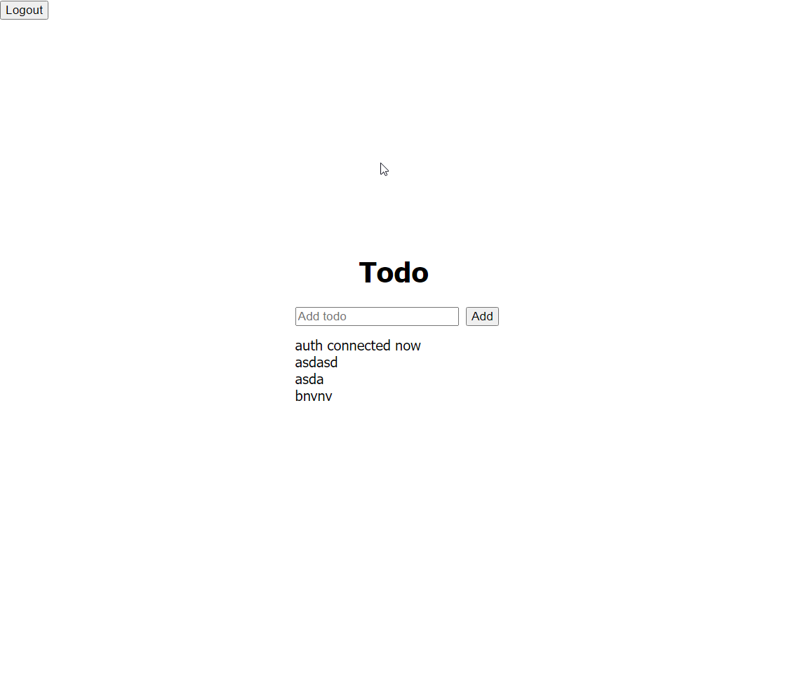

# sveltekit-nestjs
## Todo app

## Techstack
  - SvelteKit
  - NestJS
  - Supabase
  - Postgres

## Screenshots



## To run
```
    # in one terminal
    cd frontend
    npm i
    npm run dev
```
```
    # using another terminal
    cd backend
    npm i
    npm run start:dev
```
